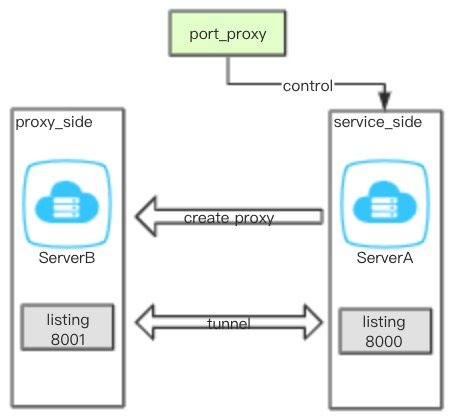

### 摘要
本程序依托supervisor和autossh软件功能, 利用Python fabric执行目标机器开启端口映射隧道，简单讲就是web版的autossh端口映射功能。

适用于：端口代理、服务发布利器，尤其适用于内外网之间映射端口的管理。
对于autossh时常断开等不可阻抗的因素，将autossh进程加入supervisor进行监控，使得autossh结束后，可以自动重启。

注：
+ 利用本代理服务可能导致服务器密码泄露。本程序利用autossh建立隧道至目标服务器，期间需要目标服务器的授权，这里这里直接把密码等信息存在了服务所在服务器中，可能造成泄露。
+ 本系统在使用过程中，如果开启了supervisor，可能对原有的supervisor程序终止。
+ 本软件仅供测试使用，使用过程发生的一切后果均由使用方负责。
### 工作原理
如下图所示：

port_proxy控制ServerA的监听服务8000到ServerB的监听服务8001，使得访问ServerB的8001等价于访问ServerA的8000（以上功能是autossh提供的）


### 安装说明
本项目（port_proxy)后台使用django 框架，前端使用vue-admin-demo(详见readme_fe)。
+ 创建虚拟环境： 使用virtualenv等
+ 安装依赖: ```pip install -r port_proxy/requirements.md```
+ 创建数据库: 
```
cd port_proxy
python manage.py migrate
python manage.py makemigrations interface
python manage.py migrate interface
```
+ 创建管理员: ```python manage.py createsuperuser```
+ 注释或修改uwsgi.ini中的```virtualenv```
+ 启动：```cd port_proxy``` and ```uwsgi --ini uwsgi.ini``` 或``` python manage.py runserver```
+ 浏览器输入:```localhost:8000```

### 修改前端代码
修改前端代码参考[READMME_fe](READMME_fe.md)
编译完成后，把```build/dist```下面的文件覆盖```port_proxy/static```即可
### docker部署
> +注释uwsgi.ini中的virtualenv

制作docker 镜像:
+ ```docker build -t {image_name} .```

启动docker，uwsig默认使用8000端口，请根据需要映射端口